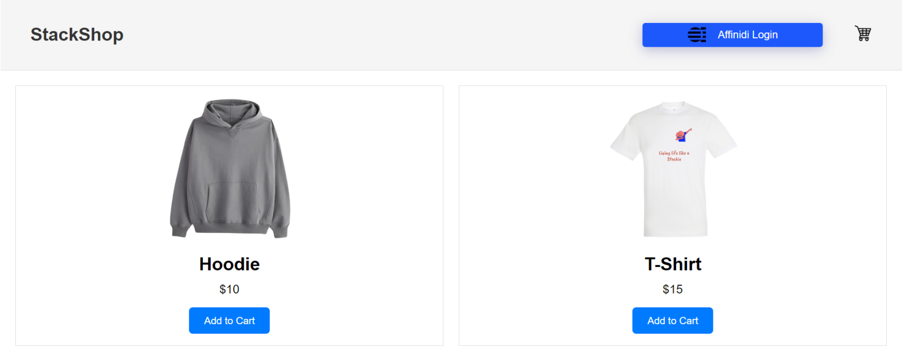
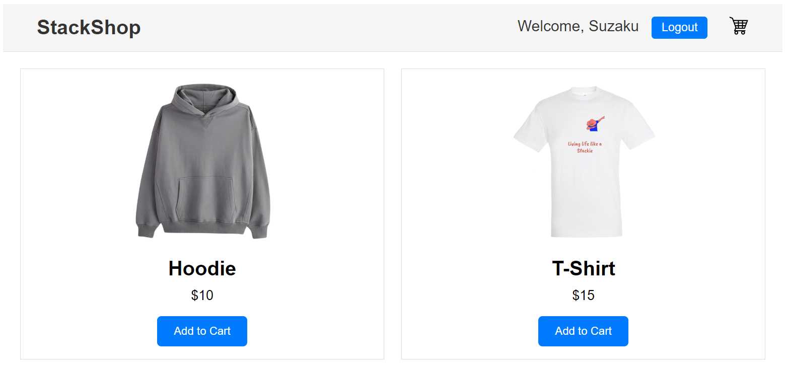
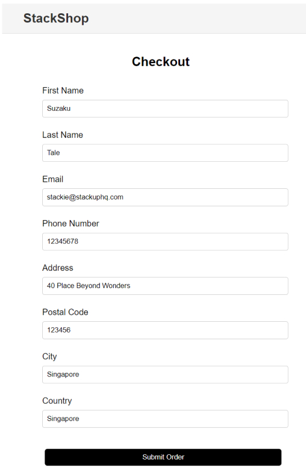

# AFFINIDI Capstone Project

An online store. Users will be able to add items to their cart. Conventionally, at this point a user is prompted to fill out long forms; leading to cart abandonment. Form fatigue is a major reason why a lot of businesses lose consumers at checkouts. But since we now have a way to mitigate it, let's see how we can create a better user experience.

## Showcase

## Table of Contents

- [AFFINIDI Capstone Project](#affinidi-capstone-project)
	- [Showcase](#showcase)
	- [Table of Contents](#table-of-contents)
	- [Installation](#installation)
	- [Usage](#usage)
	- [Features](#features)
	- [Contributing](#contributing)
	- [License](#license)

## Installation

1. Clone the repository.
2. Install the dependencies using `npm install`.

## Usage

1. Start the development server using `npm start`.
2. Open your browser and navigate to `http://localhost:3000`.

## Features

- Feature 1: Description of feature 1.
- Feature 2: Description of feature 2.
- ...

## Contributing

Contributions are welcome! Please follow the guidelines in [CONTRIBUTING.md](CONTRIBUTING.md).

## License

This project is licensed under the [MIT License](LICENSE).
